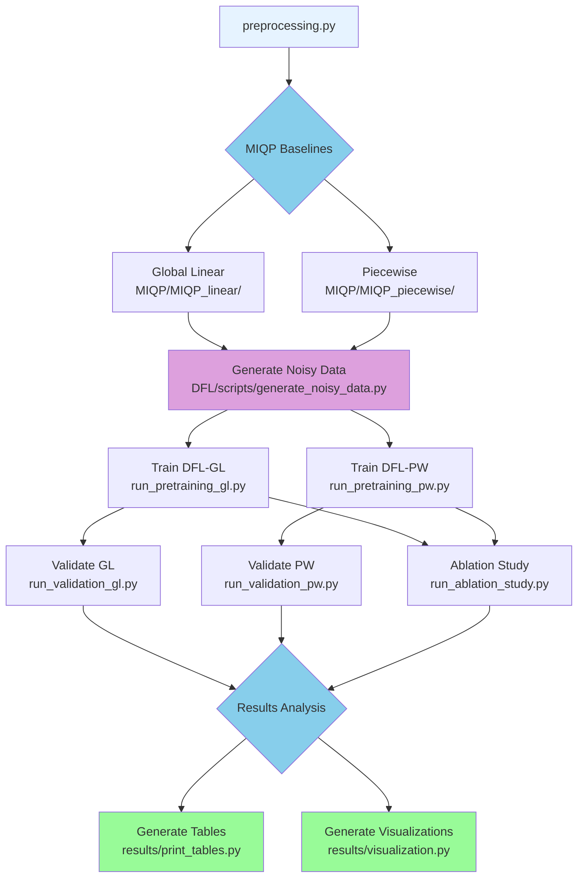
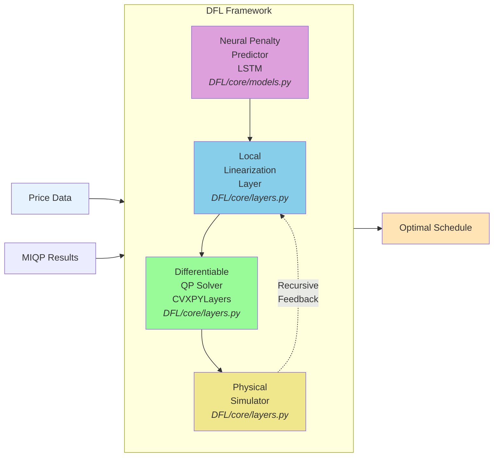

# DFL4UPHES

[](https://arxiv.org/abs/2512.20880)
[](https://www.python.org/downloads/)
[](LICENSE)

**Decision-Focused Learning for Underground Pumped Hydro Energy Storage Day-Ahead Scheduling**

Transform intractable UPHES scheduling into fast, accurate optimization using end-to-end differentiable learning.

---

## Visual Overview

<p align="center">
  
  
</p>

<details>
<summary><b>Performance Results (Click to Expand)</b></summary>

<p align="center">
  
  <br>
  <em>Profit distribution: DFL variants vs MIQP baselines</em>
</p>

<p align="center">
  
  <br>
  <em>Performance under forecast noise (10-80%)</em>
</p>

</details>

---

## 🔗 Quick Links

| Resource | Description |
|----------|-------------|
| 📄 [**Paper (arXiv)**](https://arxiv.org/abs/2512.20880) | Full technical details and methodology |
| 📓 [**Interactive Tutorial**](docs/dfl_uphes_mvp.ipynb) | Jupyter notebook walkthrough |
| 🚀 [**Quick Start**](#-quick-start) | Get running in 5 minutes |
| 📚 [**Complete Workflow**](#-complete-workflow) | Full pipeline from preprocessing to results |
| 🏗️ [**Architecture**](#%EF%B8%8F-repository-architecture) | System design and structure |
| 📖 [**Citation**](#-citation) | BibTeX entry for papers |

---

## 💡 What is DFL-for-UPHES?

**The Problem**: Underground Pumped Hydro Energy Storage (UPHES) systems require day-ahead scheduling to maximize profit in electricity markets. However, the scheduling problem involves highly nonlinear pump-turbine characteristics and reservoir dynamics, making it an intractable **Mixed-Integer Nonlinear Program (MINLP)**.

**Traditional Approach**: Approximate the MINLP as a Mixed-Integer Quadratic Program (MIQP) using linearization techniques. While accurate, MIQP solvers are too slow for operational use.

**Our Solution**: Use **Decision-Focused Learning (DFL)** to train neural networks that predict optimal penalty weights for iterative linearization. The framework learns to produce high-quality schedules directly from price forecasts, achieving both speed and accuracy.

### Four DFL Variants

1. **DFL-GL-RS** ⚡: Global linear approximation with LSTM (fastest, real-time implementation tool)
2. **DFL-PW-RS** 🎯: Piecewise SOS2 approximation with LSTM (highest accuracy, refinement tool)
3. **DFL-PW-no-Rec** 🔬: Piecewise with 1 iteration (ablation study on recursion impact)
4. **DFL-PW-no-NN** 🧪: Fixed penalty weights (ablation study on neural network impact)

---

## ⚡ Quick Start

### Installation

```bash
# Clone the repository
git clone https://github.com/SOLARIS-JHU/DFL-UPHES.git
cd DFL-for-UPHES

# Install dependencies
pip install -r requirements.txt
```

### Prerequisites

**Critical**: Run preprocessing first to ensure compatibility:

```bash
python preprocessing.py
```

This updates `preprocess.pkl` for your dill library version.
**Note**: Some MIQP baseline scripts require Gurobi with a valid license (`gurobipy`). DFL training and validation work without Gurobi.

### Minimal Working Example

```bash
# 1. Generate training data
python DFL/scripts/generate_noisy_data.py --variant GL --random-samples

# 2. Train DFL model
python DFL/scripts/run_pretraining_gl.py

# 3. Validate model
python DFL/scripts/run_validation_gl.py

# 4. View results
cat DFL/outputs/validation_results/comprehensive/master_validation_benchmarks.csv
```

**Output**: Trained models in `DFL/outputs/trained_models/`, validation results in `DFL/outputs/validation_results/`.

---

## 📋 Complete Workflow

### Pipeline Workflow Diagram



### Step-by-Step Commands

**All commands must be run from the repository root.**

#### Step 1: Preprocessing

Update the preprocessed pickle file:

```bash
python preprocessing.py
```

**Output**: `preprocess.pkl` (ensures dill library compatibility)

#### Step 2: Generate MIQP Baselines

Run both MIQP baseline methods (requires Gurobi):

```bash
# Global Linearization MIQP
python MIQP/MIQP_linear/MIQP_global_linear.py

# Piecewise Linearization MIQP (with SOS2 constraints)
python MIQP/MIQP_piecewise/MIQP_piecewise.py
```

**Outputs**:
- `MIQP/MIQP_linear/MILP_global_linear_results.csv` + benchmark
- `MIQP/MIQP_piecewise/MIQP_piecewise_results.csv` + benchmark

**Note**: These scripts may take several hours to complete depending on the number of dates in the price data.

#### Step 3: Generate Noisy Training Data

Generate training datasets with noise for robustness:

```bash
# GL variant (noise levels 10%-80% + random samples)
python DFL/scripts/generate_noisy_data.py --variant GL --noise-levels "0.1,0.2,0.3,0.4,0.5,0.6,0.7,0.8" --random-samples

# PW variant (noise levels 10%-80% + random samples)
python DFL/scripts/generate_noisy_data.py --variant PW --noise-levels "0.1,0.2,0.3,0.4,0.5,0.6,0.7,0.8" --random-samples
```

**Outputs** (saved to `DFL/outputs/noisy_data/`):
- GL: `MIQP_linear_results_relative_noise_{10-80}pct.csv` + `MIQP_linear_results_random_samples.csv`
- PW: `MIQP_piecewise_results_relative_noise_{10-80}pct.csv` + `MIQP_piecewise_results_random_samples.csv`

#### Step 4: Train DFL Models

Train neural network-based optimization models:

```bash
# Global Linear (GL) variant
python DFL/scripts/run_pretraining_gl.py

# Piecewise (PW) variant
python DFL/scripts/run_pretraining_pw.py

# Piecewise No-Recursion (PW-no-Rec) variant (Ablation Study)
python DFL/scripts/run_pretraining_pw_norec.py
```

**Training Configuration**:
- GL and PW: 7 recursive linearization iterations (optimized)
- PW-no-Rec: 1 iteration (tests impact of recursive refinement)
- All variants save best model checkpoints based on validation profit

**Outputs**: Trained models in `DFL/outputs/trained_models/{data_source}/LSTM_3layer_7iter/{timestamp}/model.pt`

#### Step 5: Validate DFL Models

Evaluate models on test data:

```bash
# Global Linear variant
python DFL/scripts/run_validation_gl.py

# Piecewise variant
python DFL/scripts/run_validation_pw.py

# Piecewise No-Recursion variant
python DFL/scripts/run_validation_pw_norec.py
```

**Outputs**: Validation metrics in `DFL/outputs/validation_results/{data_source}/LSTM_3layer_7iter/scheduling_benchmarks.csv`

#### Step 5C: Fixed-Weight Baseline (Optional)

Run the fixed-weight baseline to validate neural network impact:

```bash
python DFL/scripts/run_ablation_study.py
```

**Configuration**: Fixed weights (w_p=0.1, w_q=0.01, w_h=0.05) with 7 recursive iterations (no neural network).

#### Step 6: Aggregate Validation Results

Combine results from all 4 variants into a master file:

```bash
python results/aggregate_validation_results.py
```

**Output**: `DFL/outputs/validation_results/comprehensive/master_validation_benchmarks.csv`

**Aggregated Variants**:
- **DFL-GL-RS**: GL-based (7 iterations, LSTM)
- **DFL-PW-RS**: PW-based (7 iterations, LSTM)
- **DFL-PW-no-Rec**: PW no-recursion (1 iteration, LSTM)
- **DFL-PW-no-NN**: PW no-neural-network (7 iterations, fixed weights)

#### Step 7: Generate Tables and Visualizations

Generate publication-quality tables and plots:

```bash
# Generate comprehensive comparison tables
python results/print_tables.py

# Generate publication-quality visualizations
python results/visualization.py
```

**Outputs**:

**Tables** (in `results/tables/`):
- `comprehensive_comparison.tex` - LaTeX table for papers
- `comprehensive_comparison.csv` - CSV summary for reference

**Figures** (in `results/figures/`):
- `profit_density_main_contribution.{pdf,png}` - Profit distribution comparisons (GL vs PW)
- `noise_robustness_dfl_vs_miqp.{pdf,png}` - DFL performance vs MIQP across noise levels
- `noise_robustness_ablation_study.{pdf,png}` - Ablation study robustness analysis
- `profit_vs_penalties_ablation.{pdf,png}` - Profit-penalty trade-off visualizations

<!-- ### Full Workflow Script

To run the entire pipeline automatically:

```bash
#!/bin/bash
set -e  # Exit on first error

echo "=== Cleanup Previous Outputs ==="
rm -rf DFL/outputs/noisy_data \
  DFL/outputs/trained_models \
  DFL/outputs/validation_results \
  results/tables \
  results/figures

echo "=== Step 1: Preprocessing ==="
python preprocessing.py

echo "=== Step 2: MIQP Baselines ==="
python MIQP/MIQP_linear/MIQP_global_linear.py
python MIQP/MIQP_piecewise/MIQP_piecewise.py

echo "=== Step 3: Generate Noisy Data ==="
python DFL/scripts/generate_noisy_data.py --variant GL --noise-levels "0.1,0.2,0.3,0.4,0.5,0.6,0.7,0.8" --random-samples
python DFL/scripts/generate_noisy_data.py --variant PW --noise-levels "0.1,0.2,0.3,0.4,0.5,0.6,0.7,0.8" --random-samples

echo "=== Step 4: Train DFL Models ==="
python DFL/scripts/run_pretraining_gl.py
python DFL/scripts/run_pretraining_pw.py
python DFL/scripts/run_pretraining_pw_norec.py

echo "=== Step 5: Validate DFL Models ==="
python DFL/scripts/run_validation_gl.py
python DFL/scripts/run_validation_pw.py
python DFL/scripts/run_validation_pw_norec.py

echo "=== Step 5C: Fixed-Weight Baseline ==="
python DFL/scripts/run_ablation_study.py

echo "=== Step 6: Aggregate Results ==="
python results/aggregate_validation_results.py

echo "=== Step 7: Generate Tables ==="
python results/print_tables.py

echo "=== Step 8: Generate Visualizations ==="
python results/visualization.py

echo "=== Pipeline Complete ==="
```

Save as `run_full_pipeline.sh`, then execute:

```bash
bash run_full_pipeline.sh
``` -->

---

## 🏗️ Repository Architecture

### Component Architecture

The DFL framework consists of four differentiable components trained end-to-end:



**Component Details**:

1. **Neural Penalty Predictor** (`DFL/core/models.py`)
   - LSTM network predicting time-varying penalty weights
   - Outputs: `w_p` (power), `w_q` (flow), `w_h` (head)
   - Bounded log-domain predictions for stability

2. **Local Linearization Layer** (`DFL/core/layers.py`)
   - First-order Taylor approximations around operational points
   - Linearizes nonlinear flow-power-head and volume-head relationships

3. **Differentiable Convex Optimizer** (`DFL/core/layers.py`)
   - CVXPYLayers wrapper for quadratic programming
   - Uses ECOS solver with tight tolerances (1e-5)
   - Provides gradients for end-to-end training

4. **Physical Simulator** (`DFL/core/layers.py`)
   - Validates schedules under true nonlinear dynamics
   - Computes ex-post profit with penalties for violations

**Pipeline Orchestration** (`DFL/core/pipeline.py`):
- `RecursiveLinearizationPipeline`: With neural network weight prediction
- `BaselineRecursiveLinearization`: With fixed weights (ablation)
- Manages K recursive linearization iterations with penalty growth

### Directory Structure

```
DFL-for-UPHES/
│
├── 📊 Data/                      # Input data and UPC information
│   ├── UPCs/                     # Unit Performance Curves
│   └── price_data_2024.csv       # Day-ahead electricity prices
│
├── 🧠 DFL/                        # Main DFL Framework (Refactored)
│   ├── config/                   # Configuration classes (GL/PW/Ablation)
│   ├── core/                     # Core DFL components
│   │   ├── models.py             # Neural penalty predictor (LSTM)
│   │   ├── layers.py             # Linearization, solver, simulator
│   │   └── pipeline.py           # Recursive refinement orchestrator
│   ├── data/                     # Data loaders and noise injection
│   ├── training/                 # End-to-end training procedures
│   ├── validation/               # Model evaluation
│   ├── utils/                    # Helper utilities
│   ├── scripts/                  # CLI entry points
│   │   ├── generate_noisy_data.py
│   │   ├── run_pretraining_gl.py
│   │   ├── run_pretraining_pw.py
│   │   ├── run_validation_gl.py
│   │   ├── run_validation_pw.py
│   │   └── run_ablation_study.py
│   └── outputs/                  # All generated outputs
│       ├── noisy_data/           # Training data (10-80% noise)
│       ├── trained_models/       # Neural network checkpoints
│       └── validation_results/   # Performance benchmarks
│
├── 🔢 MIQP/                       # MIQP Baseline Methods
│   ├── MIQP_linear/              # Global linearization baseline
│   └── MIQP_piecewise/           # Piecewise SOS2 baseline
│
├── 📦 Legacy/                     # Stable legacy implementations
│   ├── DFL_GL-based/             # GL training-data variant
│   ├── DFL_PW-based/             # PW training-data variant
│   └── DFL_no-NN/                # Ablation study baseline
│
├── 📈 results/                    # Publication outputs
│   ├── tables/                   # LaTeX & CSV comparison tables
│   ├── figures/                  # PDF & PNG visualizations
│   ├── print_tables.py           # Table generation script
│   └── visualization.py          # Visualization script
│
├── 🔬 linearization_error/        # Approximation accuracy analysis
├── 📚 Library/                    # System configuration files
├── 📄 preprocessing.py            # Preprocessing script
└── 📄 preprocess.pkl              # Preprocessed UPC data
```

---

## 📓 Interactive Tutorial

Explore the framework hands-on with our Jupyter notebook:

📔 **[DFL-UPHES Interactive Tutorial](docs/dfl_uphes_mvp.ipynb)**

The notebook covers:
- Problem formulation and motivation
- DFL framework architecture walkthrough
- Step-by-step training and validation
- Performance comparison with MIQP baselines
- Visualization of results

---

## 🛠️ Advanced Usage

### Parallel Processing Options

We use `joblib` with 20 workers by default to accelerate large scale pretraining for CPU. Adjust via `--n-jobs`:

```bash
# Reduce workers for debugging or memory constraints
python DFL/scripts/run_pretraining_gl.py --n-jobs 4

# Single worker for debugging
python DFL/scripts/run_pretraining_gl.py --n-jobs 1

# Use all CPU cores
python DFL/scripts/run_pretraining_gl.py --n-jobs -1
```

### Custom Validation Data

Use custom price data files:

```bash
python DFL/scripts/run_validation_gl.py --price-file ./custom_prices.csv
python DFL/scripts/run_ablation_study.py --price-file ./my_prices.csv
```

### Modify Configuration

Edit configuration files to customize behavior:
- `DFL/config/gl_config.py` - Global Linear settings
- `DFL/config/pw_config.py` - Piecewise settings
- `DFL/config/pw_norec_config.py` - No-recursion variant
- `DFL/config/ablation_config.py` - Fixed-weight baseline

### Generate Specific Noise Levels

Generate only specific noise levels instead of 10-80%:

```bash
python DFL/scripts/generate_noisy_data.py --variant GL --noise-levels "0.1,0.2,0.3"
```

---

## 🔍 Understanding Results

### Key Metrics

- **Ex-post Profit (€)**: Revenue minus costs and penalties (higher is better)
- **System Imbalance (€)**: Penalty for power deviations from schedule (lower is better)
- **Volume Violations (€)**: Penalty for reservoir constraint violations (lower is better)
- **Computation Time (s)**: Wall-clock time for optimization (lower is better)

### Output Locations

- **Training data**: `DFL/outputs/noisy_data/`
- **Trained models**: `DFL/outputs/trained_models/`
- **Benchmarks**: `DFL/outputs/validation_results/`
- **Master results**: `DFL/outputs/validation_results/comprehensive/master_validation_benchmarks.csv`
- **Tables**: `results/tables/`
- **Figures**: `results/figures/`

---

## 🐛 Troubleshooting

### Common Issues

**Missing preprocess.pkl**:
```bash
python preprocessing.py  # Run this first!
```

**CVXPY solver errors**:
- Ensure ECOS is installed: `pip install ecos`
- Check solver tolerances in config files

**Memory issues**:
```bash
# Reduce parallel workers
python DFL/scripts/run_pretraining_gl.py --n-jobs 4
```

**File not found errors**:
- Verify you're running from repo root
- Check that `DFL/outputs/` subdirectories exist:
  ```bash
  mkdir -p DFL/outputs/{noisy_data,trained_models,validation_results}
  ```

**Gurobi license errors**:
- Only needed for MIQP baseline generation
- DFL training/validation work without Gurobi

**scipy/ECOS compatibility**:
- Code includes automatic compatibility patch for scipy 1.13+
- No action needed from users

---

## 📚 Documentation

### Core Documentation

- 📋 [**DFL/README.md**](DFL/README.md) - DFL framework-specific documentation
- 📊 [**docs/repository_graphs.md**](docs/repository_graphs.md) - Mermaid diagrams and architecture
- 📓 [**docs/dfl_uphes_mvp.ipynb**](docs/dfl_uphes_mvp.ipynb) - Interactive tutorial notebook

<!-- ### Legacy vs. Refactored Code

This repository contains both refactored and legacy implementations:

**Refactored Framework** (`DFL/`):
- ✅ Modular, configuration-driven design
- ✅ Clean separation of concerns
- ✅ Easy to extend and modify
- ⚠️ Actively maintained, may contain bugs

**Legacy Implementations** (`DFL_GL-based/`, `DFL_PW-based/`, `DFL_no-NN/`):
- ✅ Stable and tested
- ✅ Recommended for reproducible results
- ✅ Original paper validation
- ⚠️ Less structured, harder to modify

**When to use legacy**: Guaranteed reproducible results, running full experiments from scratch, original paper validation.

**When to use refactored**: Extending the framework, adding new variants, modifying configurations, modern codebase maintenance.

Both use identical algorithms and parameters for consistency. -->

---

## 📖 Citation

If you use this code in your research, please cite our paper:

```bibtex
@article{zheng2026accelerating,
  title={Accelerating Underground Pumped Hydro Energy Storage Scheduling with Decision-Focused Learning},
  author={Zheng, Honghui and Favaro, Pietro and Dvorkin, Yury and Drgo{\v{n}}a, J{\'a}n},
  journal={IEEE Transactions on Sustainable Energy},
  year={2026},
  note={Early Access},
  doi={10.1109/TSTE.2026.3722492}
}
```

### Paper Reference

**"Accelerating Underground Pumped Hydro Energy Storage Scheduling with Decision-Focused Learning"**
IEEE Transactions on Sustainable Energy (Early Access): [https://doi.org/10.1109/TSTE.2026.3722492](https://doi.org/10.1109/TSTE.2026.3722492)
Accepted version (open access) on arXiv: [https://arxiv.org/abs/2512.20880](https://arxiv.org/abs/2512.20880)


---

## 📄 License

This project is licensed under the MIT License. See the [LICENSE](LICENSE) file for details.

---

## 📧 Contact

For questions, issues, or collaboration opportunities:
- **Open an issue** on this repository
- **Email**: [hzheng39@jh.edu](hzheng39@jh.edu)

---

## 🙏 Acknowledgments

This work was supported by [Ralph O'Connor Sustainable Energy Institute](https://energyinstitute.jhu.edu/).

We thank the open-source community for the excellent tools that made this work possible:
- PyTorch for deep learning
- CVXPY and CVXPYLayers for differentiable optimization

---

<p align="center">
  <b>⭐ If you find this work useful, please consider starring the repository! ⭐</b>
</p>
